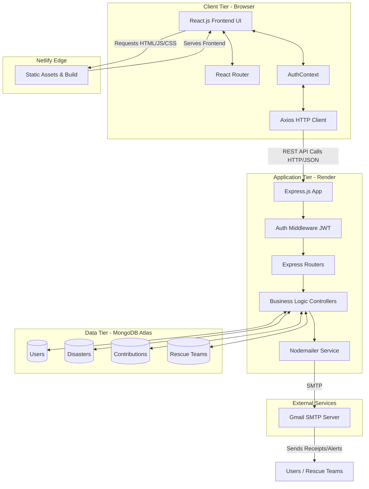
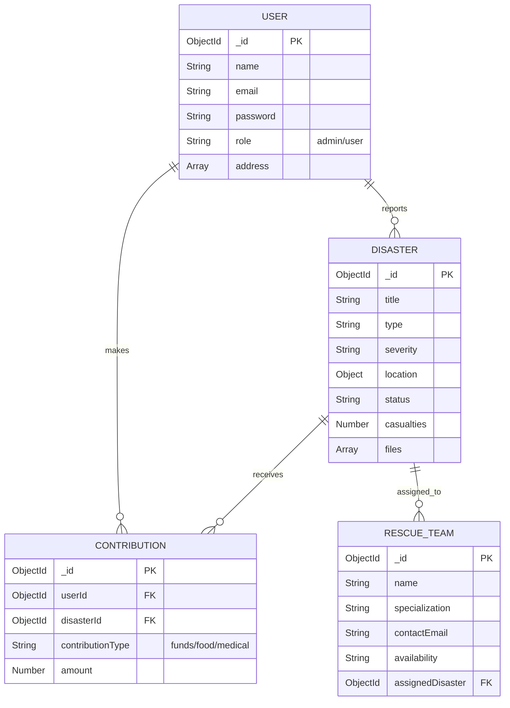
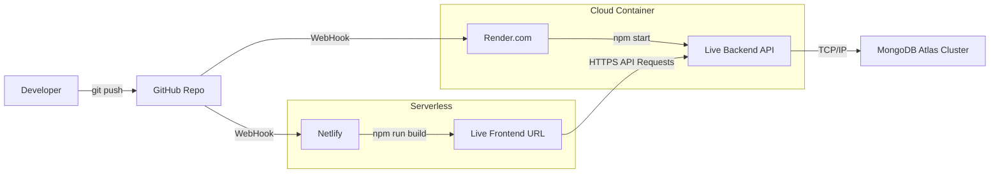

# System Architecture & Tech Stack

## 1. Technology Stack

### Frontend (Client-Side)
- **Framework:** React.js (v18)
- **Routing:** React Router DOM (v6)
- **State Management:** React Context API (`AuthContext`)
- **HTTP Client:** Axios (Interceptors configured for JWT injection)
- **Styling:** Vanilla CSS3 with modern variables, Flexbox, and CSS Grid
- **Deployment:** Netlify

### Backend (Server-Side)
- **Environment:** Node.js
- **Framework:** Express.js
- **Authentication:** JSON Web Tokens (JWT) & bcryptjs
- **File Uploads:** Multer
- **Email Delivery:** Nodemailer (SMTP)
- **Deployment:** Render (Web Service)

### Database (Data Layer)
- **Database:** MongoDB
- **Hosting:** MongoDB Atlas Cloud
- **ODM:** Mongoose

---

## 2. System Architecture Diagram

---

## 3. Database Schema Entity Relationship (ERD)

---

## 4. Deployment Architecture

