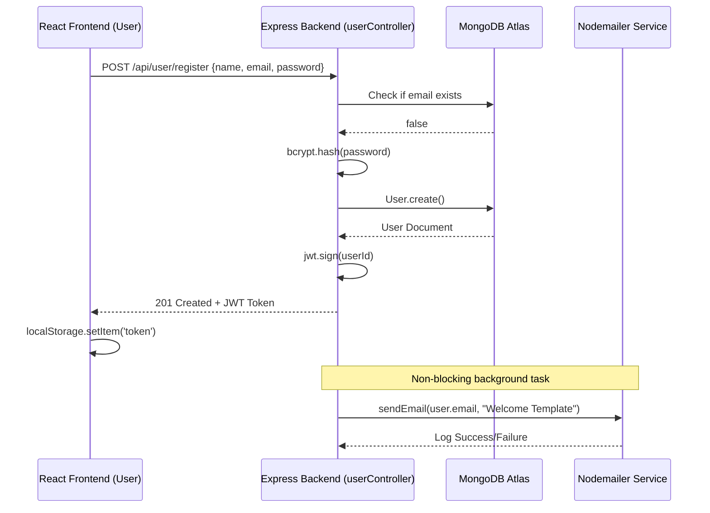
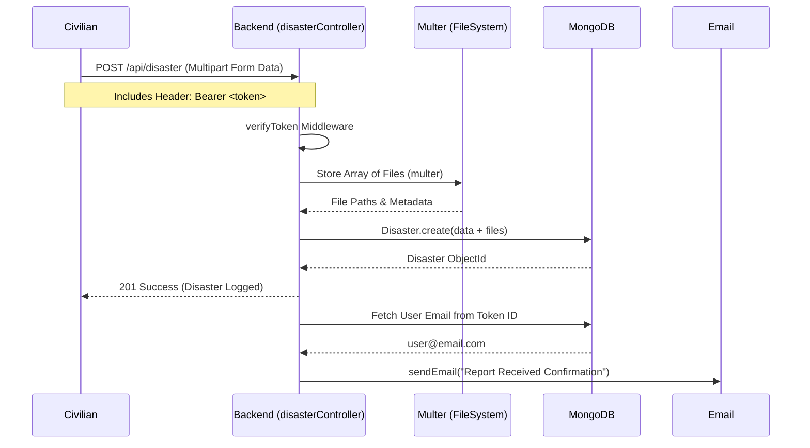
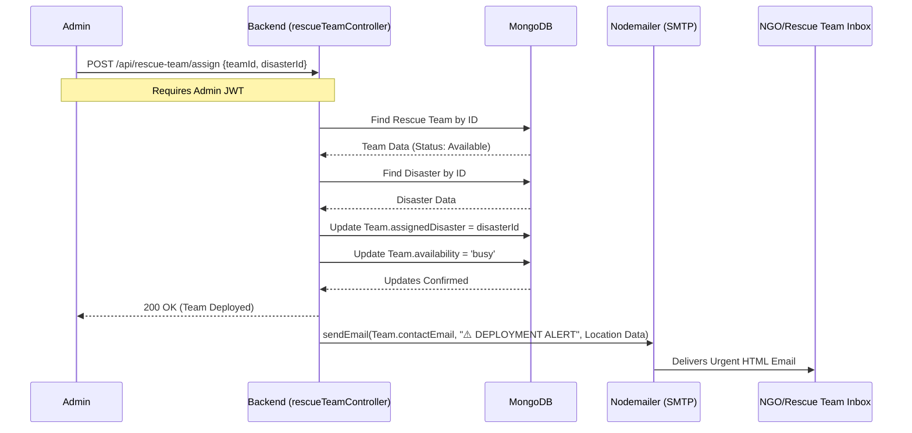

# System Workflows & Event Processing

This document details the step-by-step lifecycles of major events within the **ResQNet** platform.

---

## 1. User Registration & Authentication Workflow

---

## 2. Disaster Reporting Workflow

---

## 3. Rescue Team Assignment Workflow

---

## 4. UI / Wireframe Flow Navigation

1. **Landing Page (`/`)**
   - Introduces ResQNet.
   - Public metrics (Active Disasters, Total Rescue Teams).
   - *Call to Actions*: Login, Register Rescue Team.

2. **Dashboard (`/dashboard`)**
   - Protected Route.
   - Summarizes user activity (Reports made, Contributions given).
   - Admin view includes global system controls instead of user summary.

3. **Disaster Hub (`/disasters`)**
   - Grid layout of all active incidents.
   - Filters for 'Type' and 'Severity'.
   - 'Contribute' button opens modal/page.

4. **Rescue Team Portal (`/admin/rescue-teams`)**
   - *Admin Only.*
   - Table view of all NGOs.
   - 'Assign' action opens modal linking to active disaster IDs.
